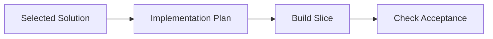

## Start Summary
- Required: yes
- Reason: Missing core planning inputs.
- Selected Idea: Initial candidate
- Alternatives Considered: Option A | Option B
- Pre-mortem Risk: TBD
- Handoff Confidence: 1

## Goal
- One-sentence target outcome.

## Scope (In/Out)
- In: Core work items.
- Out: Non-goals.

## Constraints
- Key constraints: Time, risk, compatibility.

## Assumptions
- A1: Primary assumption.

## Open Decisions
- [ ] D1: One unresolved decision.
- Remaining Count: 1

## Technical Solution Diagram

- Notes: Keep this diagram updated as implementation decisions evolve.

## Implementation Tasks
- [ ] `path/to/file`: implement scoped change.

## Acceptance Criteria
- [ ] Core behavior is correct.
- [ ] Validation commands pass.

## Validation Commands
- npm test

## Risks & Rollback
- Risk: Main failure mode.
- Mitigation: Primary mitigation.
- Rollback: Revert strategy.

## Go/No-Go Checklist
- [ ] Goal is explicit
- [ ] Scope in/out is explicit
- [ ] No unresolved high-impact decisions
- [ ] Tasks and validation commands are implementation-ready

## WIP Log
- Status: Not started
- Blockers: None
- Next step: Plan first concrete task slice
