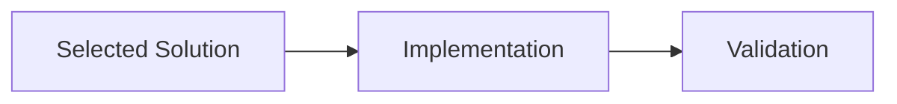

# Plan Spec: <feature-or-change>

## Objective
- Goal: <one clear outcome>
- Out of scope: <non-goals>

## Constraints
- Technical:
- Time:
- Risk:

## Affected Areas
- Files/modules:
- External dependencies:

## Technical Solution Diagram

## Task Breakdown
1. <task with file path>
2. <task with file path>

## Acceptance Criteria
- [ ] <testable criterion 1>
- [ ] <testable criterion 2>

## Validation Plan
- <command 1>
- <command 2>

## Risks and Fallback
- Risk:
- Mitigation:
- Fallback:

## Handoff
- Next command: build
- Next action: Implement one scoped task and record validation outcomes.

## Plan Lifecycle Mutation
- Plan file path: `.local/plans/<active-plan>.md` (reuse-first; create only when required)
- Frontmatter updates: `request_id`, `parent_plan_id`, `lifecycle_phase`, `updated_at`, `decision`, `next_command`, `next_mode`
- Frontmatter policy: set `diagram_mode` as `required|auto|hidden`.
- Section updates: enforce Technical Solution Diagram only when `diagram_mode: required`; otherwise keep Tasks/Subtasks current for fallback.
- WIP Log updates: `Status`, `Blockers`, `Next step`

## Optional Response Handoff (Compact)
- Next step: <one line>
